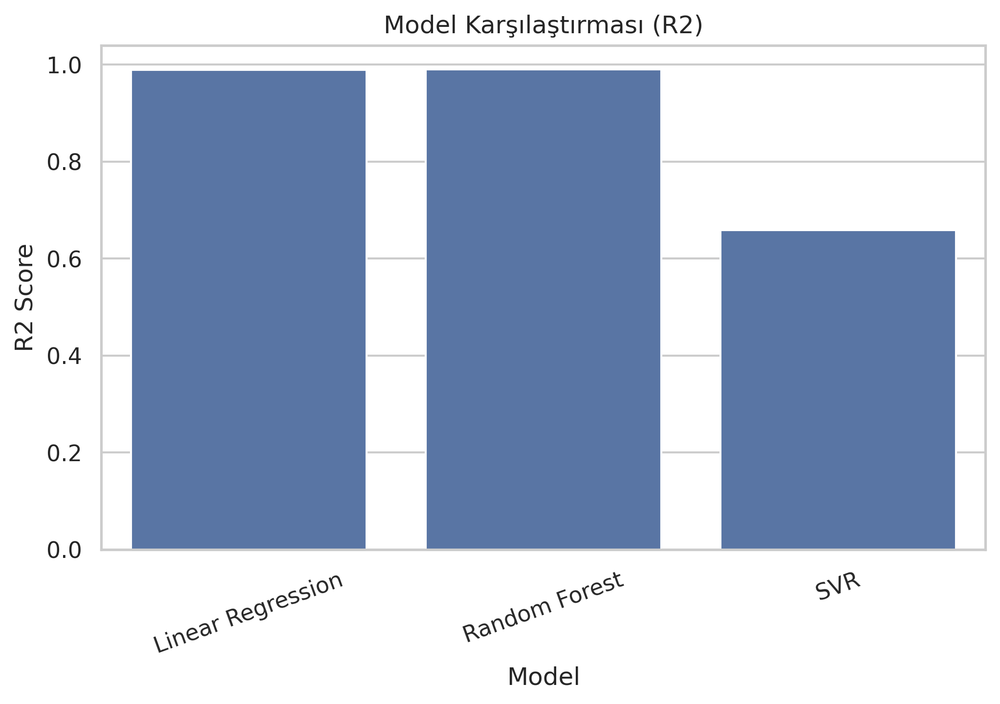
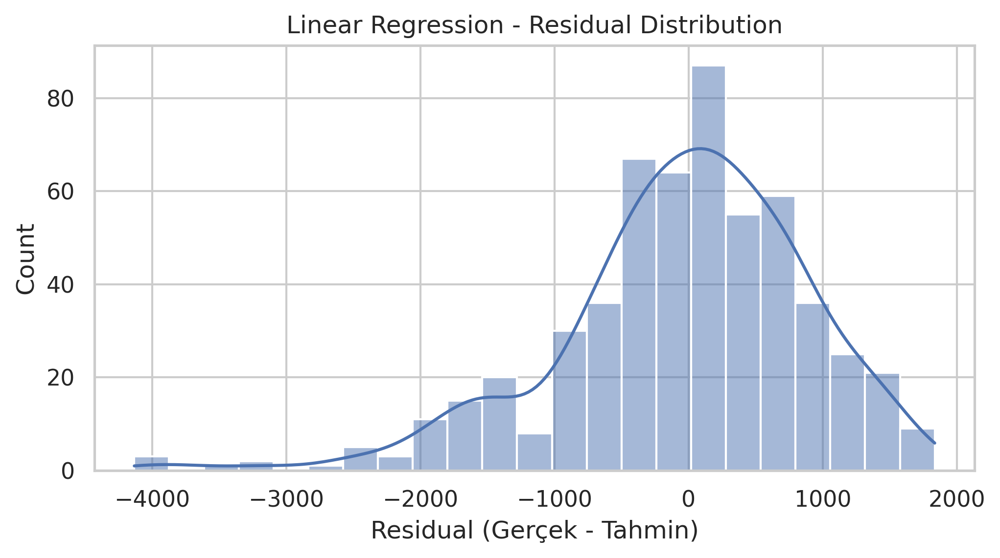
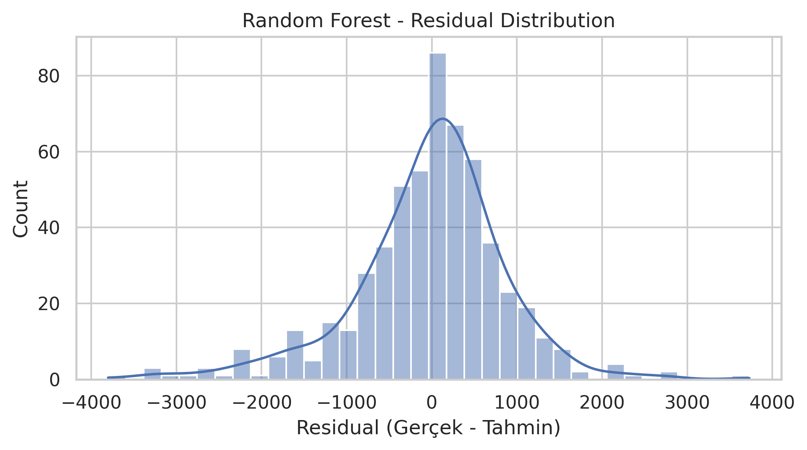
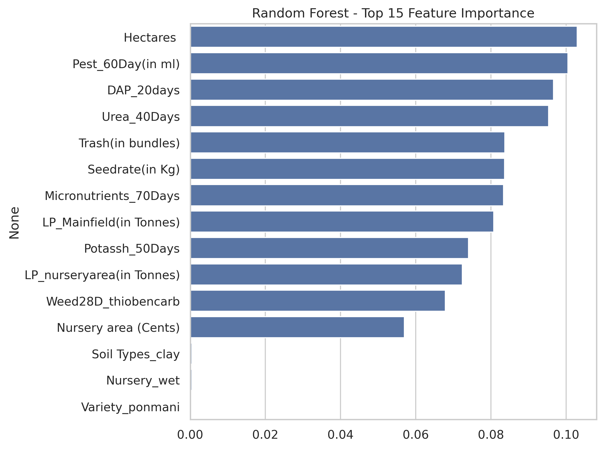
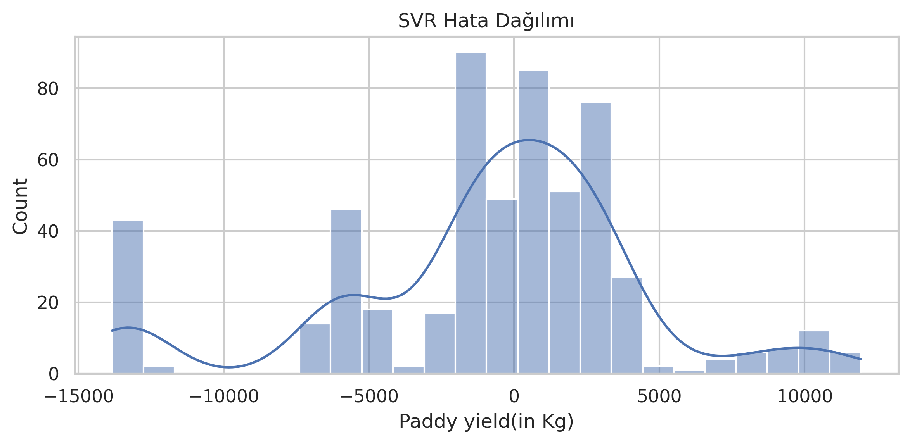

# Crop Production Prediction

Bu proje, tarımsal üretim tahmini üzerine hazırlanmış bir makine öğrenmesi çalışmasıdır.  
Hedefimiz, **Paddy yield (kg)** değerini tahmin ederek tarımsal üretim planlamasına katkı sağlamak ve verimlilik analizlerini kolaylaştırmaktır.

---

## Proje Amacı

Tarımda verim tahmini, kaynak yönetimi ve üretim planlaması açısından kritik öneme sahiptir. Bu proje ile amaçlananlar:

1. Geçmiş tarımsal verileri kullanarak verim tahmini yapmak  
2. Farklı makine öğrenmesi algoritmalarının performansını karşılaştırmak  
3. Üretimi etkileyen başlıca faktörleri ortaya koymak

---

## Veri Seti

Veri seti: [Predict Crop Production (Kaggle)](https://www.kaggle.com/datasets/stealthtechnologies/predict-crop-production)

Veri seti farklı tarımsal ve iklimsel değişkenler içerir.

Hedef değişken: **Paddy yield(in Kg)**

---

## Kullanılan Modeller

- **Linear Regression**  
- **Random Forest Regressor**  
- **Support Vector Regression (SVR)**

---

## Model Performans

| Model | MAE | RMSE | R² Score |
|-------|-----:|------:|--------:|
| Linear Regression | 698.32 | 927.94 | 0.9894 |
| Random Forest | 512.34 | 678.45 | 0.9952 |
| SVR | 3685.245102 | 5262.527620 | 0.658560 |

---

## Grafikler

### Model Karşılaştırması (R²)

### Random Forest — Gerçek vs Tahmin

### Linear Regression - Residual Dağılımı

### Random Forest - Residual Dağılımı

### Random Forest - Feature Importance (Top 15)

### SVR - Hata Dağılımı

---

## Açıklamalar

- Scatter plot gerçek ve tahmin edilen değerleri karşılaştırır; ideal doğrultu çizgisi gösterilmiştir.  
- Residual plot’lar model hatalarının dağılımını gösterir; simetrik ve dar dağılım iyi performansı işaret eder.  
- Feature importance grafiği, Random Forest modelinin hangi değişkenlere daha çok güvendiğini ortaya koyar.

---

## Nasıl Çalıştırılır

1. `paddydataset.csv` dosyasını Colab veya lokal ortama koy.  
2. `notebook.ipynb` dosyasını aç ve sırasıyla hücreleri çalıştır.  
3. Grafikler `*.png` olarak üretilecektir; README içindeki görüntülerin görüntülenmesi için PNG dosyalarını repo köküne yükleyin.

---

## Licence & Kaynak
Veri seti: Kaggle — Predict Crop Production
