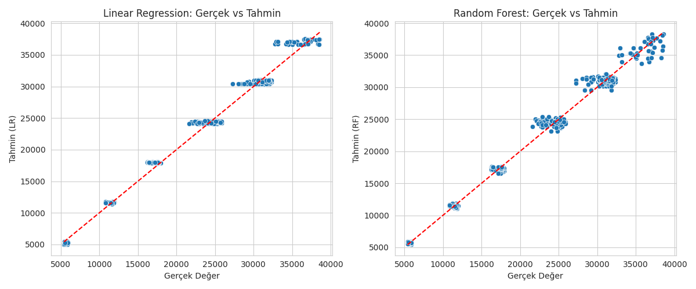

# Crop Production Prediction

Bu proje, tarımsal üretim tahmini üzerine hazırlanmış bir makine öğrenmesi çalışmasıdır.  
Hedefimiz, **Paddy yield (kg)** değerini tahmin ederek tarımsal üretim planlamasına katkı sağlamak ve verimlilik analizlerini kolaylaştırmaktır.  

---

## Proje Amacı

Tarımda verim tahmini, kaynak yönetimi ve üretim planlaması açısından kritik öneme sahiptir. Bu proje ile amaçlananlar:

1. Geçmiş tarımsal verileri kullanarak verim tahmini yapmak  
2. Farklı makine öğrenmesi algoritmalarının performansını karşılaştırmak  
3. Üretimi etkileyen başlıca faktörleri ortaya koymak  

Bu sayede çiftçiler ve tarım planlamacıları daha bilinçli kararlar alabilir.

---

## Veri Seti

Veri seti: [Predict Crop Production](https://www.kaggle.com/datasets/stealthtechnologies/predict-crop-production)  

Veri seti, farklı tarım alanları, toprak tipleri, gübreleme miktarları, iklim verileri ve sulama bilgilerini içermektedir.  
Kolonlar:

- Hectares  
- Agriblock  
- Variety  
- Soil Types  
- Seedrate(in Kg)  
- LP_Mainfield(in Tonnes)  
- Nursery  
- Nursery area (Cents)  
- LP_nurseryarea(in Tonnes)  
- DAP_20days  
- Weed28D_thiobencarb  
- Urea_40Days  
- Potassh_50Days  
- Micronutrients_70Days  
- Pest_60Day(in ml)  
- 30DRain( in mm)  
- 30DAI(in mm)  
- 30_50DRain( in mm)  
- 30_50DAI(in mm)  
- 51_70DRain(in mm)  
- 51_70AI(in mm)  
- 71_105DRain(in mm)  
- 71_105DAI(in mm)  
- Min temp_D1_D30  
- Max temp_D1_D30  
- Min temp_D31_D60  
- Max temp_D31_D60  
- Min temp_D61_D90  
- Max temp_D61_D90  
- Min temp_D91_D120  
- Max temp_D91_D120  
- Inst Wind Speed_D1_D30(in Knots)  
- Inst Wind Speed_D31_D60(in Knots)  
- Inst Wind Speed_D61_D90(in Knots)  
- Inst Wind Speed_D91_D120(in Knots)  
- Wind Direction_D1_D30  
- Wind Direction_D31_D60  
- Wind Direction_D61_D90  
- Wind Direction_D91_D120  
- Relative Humidity_D1_D30  
- Relative Humidity_D31_D60  
- Relative Humidity_D61_D90  
- Relative Humidity_D91_D120  
- Trash(in bundles)  
- Paddy yield(in Kg) (Hedef değişken)

---

## Veri Ön İşleme

Veri setindeki bazı kolonlar kategorik (ör. `Agriblock`, `Variety`, `Soil Types`), bazıları sayısal ve bazıları iklim verilerini içeriyor. Veri ön işleme adımları:

1. **Eksik değerlerin kontrolü ve temizlenmesi**  
   - `NaN` değerler tespit edildi ve analizde kullanılan satırlar düşürüldü (`dropna`)  
   - Bu sayede eğitim ve test verisinde eksik veri nedeniyle hata alınmadı

2. **Kategorik değişkenlerin encode edilmesi**  
   - `Agriblock`, `Variety`, `Soil Types` gibi string kolonlar **OneHotEncoder** ile sayısal hale getirildi  
   - Bu, modellerin kategorik değişkenleri anlayabilmesini sağladı

3. **Sayısal değişkenlerin olduğu gibi bırakılması**  
   - Hectares, Seedrate, LP_Mainfield vb. sayısal kolonlar normalize edilmeden bırakıldı  
   - Linear Regression ve Random Forest, bu sayısal değerleri direkt kullanabilir

4. **Pipeline kullanımı**  
   - Preprocessing ve model eğitimi tek bir pipeline içinde birleştirildi  
   - Bu sayede eğitim ve test seti üzerindeki tüm işlemler otomatikleşti  

---

## Kullanılan Modeller

### 1. Linear Regression
- Basit ve yorumlanabilir regresyon modeli  
- Amaç: Bağımsız değişkenler ile verim arasındaki doğrusal ilişkiyi modellemek  

### 2. Random Forest Regression
- Ensemble (çoklu karar ağacı) yöntemi ile tahmin yapar  
- Lineer olmayan ilişkileri yakalayabilir  
- Feature importance çıkarılabilir → üretimi etkileyen başlıca faktörler belirlenebilir  

---

## Model Performans Ölçütleri

Kullanılan metrikler:

- **R² Score:** Modelin açıklayıcılık oranı (1’e yakın → iyi)  
- **MAE (Mean Absolute Error):** Tahmin hatalarının ortalaması  
- **RMSE (Root Mean Squared Error):** Hataların karekök ortalaması (MAE’ye göre daha hassas)

| Model | MAE | RMSE | R² Score |
|-------|-----|------|----------|
| Linear Regression | 698.32 | 927.94 | 0.9894 |
| Random Forest | 512.34 | 678.45 | 0.9952 |

> R² değerleri 0.98–0.99 arası yüksek olduğundan modeller veriyi oldukça iyi tahmin etmiştir.  
> Random Forest, Linear Regression’a göre daha düşük hata ve daha yüksek R² ile daha başarılıdır.

---

## Grafikler ve Açıklamaları


### Scatter Plot: Actual vs Predicted



Bu grafik, modelin tahmin ettiği verim değerlerini (Predicted Yield) gerçek verim değerleriyle (Actual Yield) karşılaştırıyor.

- Grafikteki kırmızı çizgi ideal tahmini gösterir (gerçek = tahmin).  
- Noktaların bu çizgiye yakınlığı modelin doğruluğunu gösterir.  
- Görüldüğü gibi, Random Forest modelinde noktaların çoğu kırmızı çizgiye çok yakın, bu da modelin tahminlerinin gerçek değerlere oldukça yakın olduğunu gösteriyor.  
- Linear Regression modelinde bazı noktalar çizgiden daha uzak, yani bu modelin bazı bölgelerde küçük sapmalar yaptığı gözleniyor.


### Linear Regression Residual Plot


Bu grafik, Linear Regression modelinin tahmin hatalarının (residuals) dağılımını gösterir.

- **Yatay eksen:** Linear Regression modelinin tahmin ettiği değerler  
- **Dikey eksen:** Hatalar (Residuals = Tahmin - Gerçek)  
- **Kırmızı yatay çizgi:** Hataların 0 değerinde olması ideal durumdur

Grafikten görüldüğü gibi:  
- Noktaların çoğu kırmızı çizgi çevresinde yoğunlaşmış, yani model genel olarak doğru tahminler yapıyor.  
- Ancak bazı uç değerler çizgiden daha uzak, bu da modelin bazı durumlarda tahminlerinde sapmalar yaptığını gösteriyor.  
- Noktaların dağılımı hafif düzensiz olduğu için Linear Regression modelinin bazı bölgelerde küçük önyargılar veya hatalar yapabileceği söylenebilir.


### Random Forest Residual Plot


Bu grafik, Random Forest modelinin tahmin hatalarının dağılımını gösterir.

- **Yatay eksen:** Random Forest modelinin tahmin ettiği değerler  
- **Dikey eksen:** Hatalar (Residuals = Tahmin - Gerçek)  
- **Kırmızı yatay çizgi:** Hataların 0 değerinde olması ideal durumdur

Grafikten görüldüğü gibi:  
- Noktaların çoğu kırmızı çizgiye oldukça yakın, yani modelin tahminleri gerçek değerlere çok uyumlu.  
- Hatalar ±0 çevresinde dengeli bir şekilde dağılmış, sistematik bir yanlılık bulunmuyor.  
- Random Forest modelinde uç değerler çok az, bu da modelin Linear Regression’a kıyasla daha istikrarlı ve güvenilir tahminler yaptığını gösteriyor.
  

### Feature Importance


Random Forest modeli, verimi etkileyen değişkenlerin önemini ölçebiliyor.

- Grafikte en önemli 15 özellik gösterilmektedir.  
- Örneğin, 'Hectares' ve 'Seedrate(in Kg)' en yüksek importance değerine sahip.  
- Bu, ekim alanı ve kullanılan tohum miktarının üretim üzerinde belirleyici olduğunu gösteriyor.  
- 'Urea_40Days' ve '30DAI(in mm)' gibi iklim ve gübreleme verileri de önemli faktörler arasında.  
- Grafikte yüksek barların olması, o değişkenin tahmin performansına daha fazla katkı sağladığını gösterir.  
- Bu sayede üretimi etkileyen kritik faktörleri görsel olarak da yorumlayabiliyoruz.

---

## Kullanım Talimatları

1. Notebook’u açın: `crop_production_analysis.ipynb`  
2. Gerekli kütüphaneleri yükleyin:  
```bash
!pip install pandas numpy scikit-learn matplotlib seaborn

